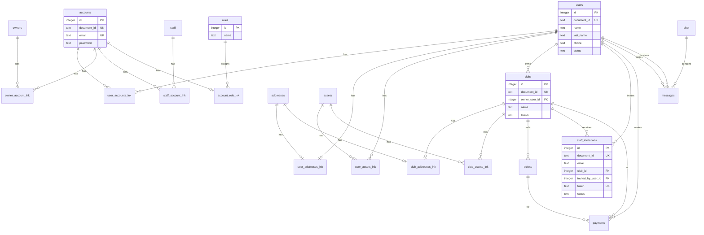

# DATABASE.md — afterdark

Documentación del esquema de base de datos del monorepo **afterdark**, alineada con `packages/db/src/schema/`.

---

## Resumen

| Aspecto     | Detalle                                                                 |
| ----------- | ----------------------------------------------------------------------- |
| Motor       | SQLite (libSQL)                                                         |
| Hosting     | [Turso](https://turso.tech/) en producción; archivo local en desarrollo |
| ORM         | [Drizzle ORM](https://orm.drizzle.team/)                                |
| Paquete     | `@afterdark/db`                                                         |
| Schemas     | `packages/db/src/schema/`                                               |
| Migraciones | `packages/db/src/migrations/`                                           |
| Tablas      | 22                                                                      |

La API (`apps/api`) importa el cliente y los schemas desde `@afterdark/db`. No hay capa TypeORM ni entidades con decoradores.

---

## Catálogo de tablas

Cada tabla incluye las columnas base (`id`, `document_id`, `created_at`, `updated_at`) salvo que se indique lo contrario.

| Tabla SQL            | Export TS          | Archivo schema         | Tipo    |
| -------------------- | ------------------ | ---------------------- | ------- |
| `users`              | `users`            | `user.ts`              | Entidad |
| `owners`             | `owners`           | `owner.ts`             | Entidad |
| `staff`              | `staff`            | `staff.ts`             | Entidad |
| `accounts`           | `accounts`         | `account.ts`           | Entidad |
| `roles`              | `roles`            | `role.ts`              | Entidad |
| `addresses`          | `addresses`        | `address.ts`           | Entidad |
| `assets`             | `assets`           | `asset.ts`             | Entidad |
| `clubs`              | `clubs`            | `club.ts`              | Entidad |
| `services`           | `services`         | `service.ts`           | Entidad |
| `tickets`            | `tickets`          | `ticket.ts`            | Entidad |
| `payments`           | `payments`         | `payment.ts`           | Entidad |
| `chat`               | `chats`            | `chat.ts`              | Entidad |
| `messages`           | `messages`         | `messages.ts`          | Entidad |
| `staff_invitations`  | `staffInvitations` | `staff-invitation.ts`  | Entidad |
| `account_role_lnk`   | `accountRolesLnk`  | `account-role-lnk.ts`  | Enlace  |
| `user_accounts_lnk`  | `userAccountsLnk`  | `user-account-lnk.ts`  | Enlace  |
| `owner_account_lnk`  | `ownerAccountsLnk` | `owner-account-lnk.ts` | Enlace  |
| `staff_account_lnk`  | `staffAccountsLnk` | `staff-account-lnk.ts` | Enlace  |
| `user_addresses_lnk` | `userAddressesLnk` | `user-address-lnk.ts`  | Enlace  |
| `user_assets_lnk`    | `userAssetsLnk`    | `user-asset-lnk.ts`    | Enlace  |
| `club_addresses_lnk` | `clubAddressesLnk` | `club-address-lnk.ts`  | Enlace  |
| `club_assets_lnk`    | `clubAssetsLnk`    | `club-asset-lnk.ts`    | Enlace  |

Tipos inferidos por tabla: `{Nombre}Select` y `{Nombre}Insert` (ej. `UserSelect`, `StaffInvitationInsert`).

---

## Convenciones

### Columnas base

Definidas en `schema/base.ts` mediante `createBaseColumns(table)`:

| Columna (TS) | Columna (SQL) | Tipo                       | Descripción                                                        |
| ------------ | ------------- | -------------------------- | ------------------------------------------------------------------ |
| `id`         | `id`          | `integer` PK autoincrement | Clave interna; destino de todas las FKs                            |
| `documentId` | `document_id` | `text` UNIQUE              | UUID generado con `crypto.randomUUID()`; usar en API y JWT (`sub`) |
| `createdAt`  | `created_at`  | `integer` (timestamp)      | Fecha de creación                                                  |
| `updatedAt`  | `updated_at`  | `integer` (timestamp)      | Última actualización                                               |

**Regla:** las FKs apuntan a `*.id` (entero). Endpoints y frontend exponen `documentId` (string).

### Enums

Los valores de columnas `text` con enum provienen de `packages/types/src/domain.ts`:

| Constante                 | Valores                                         |
| ------------------------- | ----------------------------------------------- |
| `USER_STATUS`             | `active`, `inactive`, `private`                 |
| `OWNER_STATUS`            | `active`, `inactive`, `pending`                 |
| `STAFF_STATUS`            | `active`, `inactive`, `pending`                 |
| `USER_ROLE`               | `user`, `admin`, `owner`, `staff`               |
| `CLUB_STATUS`             | `active`, `inactive`                            |
| `STAFF_INVITATION_STATUS` | `pending`, `accepted`, `expired`, `cancelled`   |
| `TICKET_STATUS`           | `active`, `inactive`                            |
| `TICKET_TYPE`             | `general`, `vip`                                |
| `PAYMENT_STATUS`          | `completed`, `pending`, `rejected`, `cancelled` |
| `ASSET_TYPE`              | `img`, `video`                                  |
| `USER_ASSET_LINK_TYPE`    | `post`, `history`                               |

Nota: `staff_invitations.role` solo admite `user`, `owner` y `staff` (no `admin`).

### Tablas de enlace (`*_lnk`)

| Tabla                | Cardinalidad | Descripción         |
| -------------------- | ------------ | ------------------- |
| `user_accounts_lnk`  | N:1 por lado | Usuario ↔ cuenta    |
| `owner_account_lnk`  | N:1 por lado | Owner ↔ cuenta      |
| `staff_account_lnk`  | N:1 por lado | Staff ↔ cuenta      |
| `account_role_lnk`   | 1:1          | Cuenta ↔ rol        |
| `user_addresses_lnk` | 1:1          | Usuario ↔ domicilio |
| `user_assets_lnk`    | N:M          | Usuario ↔ asset     |
| `club_addresses_lnk` | 1:1          | Club ↔ domicilio    |
| `club_assets_lnk`    | N:M          | Club ↔ asset        |

---

## Diagrama de relaciones



---

## Entidades

### Identidad y acceso

#### `users` — `user.ts`

Perfil de persona (sin credenciales).

| Columna (TS) | SQL           | Tipo | Null | Default                  |
| ------------ | ------------- | ---- | ---- | ------------------------ |
| `name`       | `name`        | text | NO   | —                        |
| `lastName`   | `last_name`   | text | NO   | —                        |
| `phone`      | `phone`       | text | NO   | —                        |
| `avatar`     | `avatar`      | text | SÍ   | —                        |
| `birthday`   | `birthday`    | text | SÍ   | —                        |
| `nationalId` | `national_id` | text | SÍ   | —                        |
| `status`     | `status`      | text | NO   | `active` (`USER_STATUS`) |

#### `owners` — `owner.ts`

Perfil de propietario (mismas columnas que `users`, sin credenciales).

| Columna (TS) | SQL           | Tipo | Null | Default                   |
| ------------ | ------------- | ---- | ---- | ------------------------- |
| `name`       | `name`        | text | NO   | —                         |
| `lastName`   | `last_name`   | text | NO   | —                         |
| `phone`      | `phone`       | text | NO   | —                         |
| `avatar`     | `avatar`      | text | SÍ   | —                         |
| `birthday`   | `birthday`    | text | SÍ   | —                         |
| `nationalId` | `national_id` | text | SÍ   | —                         |
| `taxId`      | `tax_id`      | text | SÍ   | —                         |
| `status`     | `status`      | text | NO   | `active` (`OWNER_STATUS`) |

#### `staff` — `staff.ts`

Perfil de staff (nombre, contacto y estado; sin credenciales).

| Columna (TS) | SQL         | Tipo | Null | Default                   |
| ------------ | ----------- | ---- | ---- | ------------------------- |
| `name`       | `name`      | text | NO   | —                         |
| `lastName`   | `last_name` | text | NO   | —                         |
| `phone`      | `phone`     | text | NO   | —                         |
| `avatar`     | `avatar`    | text | SÍ   | —                         |
| `status`     | `status`    | text | NO   | `active` (`STAFF_STATUS`) |

#### `accounts` — `account.ts`

Credenciales de acceso.

| Columna (TS) | SQL        | Tipo | Null | Notas       |
| ------------ | ---------- | ---- | ---- | ----------- |
| `email`      | `email`    | text | NO   | UNIQUE      |
| `password`   | `password` | text | NO   | Hash bcrypt |

#### `roles` — `role.ts`

Catálogo de roles.

| Columna (TS)  | SQL           | Tipo | Null |
| ------------- | ------------- | ---- | ---- |
| `name`        | `name`        | text | NO   |
| `description` | `description` | text | SÍ   |

**Seed:** `src/seed/roles.ts` inserta `owner`, `admin`, `staff` y `user` si no existen.

#### `user_accounts_lnk` — `user-account-lnk.ts`

| Columna (TS) | SQL          | FK →          |
| ------------ | ------------ | ------------- |
| `userId`     | `user_id`    | `users.id`    |
| `accountId`  | `account_id` | `accounts.id` |

#### `owner_account_lnk` — `owner-account-lnk.ts`

| Columna (TS) | SQL          | FK →          |
| ------------ | ------------ | ------------- |
| `ownerId`    | `owner_id`   | `owners.id`   |
| `accountId`  | `account_id` | `accounts.id` |

#### `staff_account_lnk` — `staff-account-lnk.ts`

| Columna (TS) | SQL          | FK →          |
| ------------ | ------------ | ------------- |
| `staffId`    | `staff_id`   | `staff.id`    |
| `accountId`  | `account_id` | `accounts.id` |

#### `account_role_lnk` — `account-role-lnk.ts`

| Columna (TS) | SQL          | FK →          | Notas                     |
| ------------ | ------------ | ------------- | ------------------------- |
| `accountId`  | `account_id` | `accounts.id` | UNIQUE (1 rol por cuenta) |
| `roleId`     | `role_id`    | `roles.id`    |                           |

El JWT incluye `role` desde `roles.name` vía esta tabla.

---

### Clubs y ubicación

#### `clubs` — `club.ts`

| Columna (TS)  | SQL             | Tipo    | Null | Default         |
| ------------- | --------------- | ------- | ---- | --------------- |
| `name`        | `name`          | text    | NO   | —               |
| `capacity`    | `capacity`      | text    | NO   | —               |
| `description` | `description`   | text    | SÍ   | —               |
| `ownerUserId` | `owner_user_id` | integer | NO   | FK → `users.id` |
| `status`      | `status`        | text    | NO   | `active`        |

Regla de negocio (API): solo un usuario con rol `owner` puede crear invitaciones, y el club debe tener `owner_user_id` igual al `users.id` del invitador.

#### `addresses` — `address.ts`

| Columna (TS)   | SQL             | Tipo | Null |
| -------------- | --------------- | ---- | ---- |
| `address`      | `address`       | text | NO   |
| `streetNumber` | `street_number` | text | NO   |
| `state`        | `state`         | text | NO   |
| `city`         | `city`          | text | NO   |

#### `club_addresses_lnk` — `club-address-lnk.ts`

| Columna (TS) | SQL          | FK →           | Notas                         |
| ------------ | ------------ | -------------- | ----------------------------- |
| `clubId`     | `club_id`    | `clubs.id`     | UNIQUE (1 domicilio por club) |
| `addressId`  | `address_id` | `addresses.id` | UNIQUE                        |

#### `user_addresses_lnk` — `user-address-lnk.ts`

| Columna (TS) | SQL          | FK →           | Notas                            |
| ------------ | ------------ | -------------- | -------------------------------- |
| `userId`     | `user_id`    | `users.id`     | UNIQUE (1 domicilio por usuario) |
| `addressId`  | `address_id` | `addresses.id` | UNIQUE                           |

---

### Invitaciones de personal

#### `staff_invitations` — `staff-invitation.ts`

| Columna (TS)       | SQL                  | Tipo      | Null | Default          |
| ------------------ | -------------------- | --------- | ---- | ---------------- |
| `email`            | `email`              | text      | NO   | —                |
| `clubId`           | `club_id`            | integer   | NO   | FK → `clubs.id`  |
| `invitedByUserId`  | `invited_by_user_id` | integer   | NO   | FK → `users.id`  |
| `slug`             | `slug`               | text      | NO   | Segmento URL     |
| `token`            | `token`              | text      | NO   | UNIQUE           |
| `securityWordHash` | `security_word_hash` | text      | SÍ   | SHA-256 opcional |
| `expiresAt`        | `expires_at`         | timestamp | NO   | —                |
| `status`           | `status`             | text      | NO   | `pending`        |
| `role`             | `role`               | text      | NO   | `staff`          |
| `acceptedAt`       | `accepted_at`        | timestamp | SÍ   | —                |

**Endpoint:** `POST /api/invitations/staff`

---

### Tickets y pagos

#### `tickets` — `ticket.ts`

| Columna (TS)  | SQL           | Tipo      | Null | Default         |
| ------------- | ------------- | --------- | ---- | --------------- |
| `name`        | `name`        | text      | NO   | —               |
| `price`       | `price`       | real      | NO   | —               |
| `quantity`    | `quantity`    | integer   | NO   | —               |
| `status`      | `status`      | text      | NO   | `active`        |
| `startDate`   | `start_date`  | timestamp | NO   | —               |
| `endDate`     | `end_date`    | timestamp | NO   | —               |
| `description` | `description` | text      | NO   | —               |
| `clubId`      | `club_id`     | integer   | NO   | FK → `clubs.id` |
| `type`        | `type`        | text      | NO   | `general`       |

#### `payments` — `payment.ts`

| Columna (TS) | SQL         | Tipo    | Null   | FK →                                         |
| ------------ | ----------- | ------- | ------ | -------------------------------------------- |
| `ticketId`   | `ticket_id` | integer | NO     | `tickets.id`                                 |
| `userId`     | `user_id`   | integer | NO     | `users.id`                                   |
| `clubId`     | `club_id`   | integer | NO     | `clubs.id`                                   |
| `status`     | `status`    | text    | **SÍ** | Enum `PAYMENT_STATUS`; sin default en schema |
| `amount`     | `amount`    | real    | NO     | —                                            |

---

### Assets y servicios

#### `assets` — `asset.ts`

| Columna (TS) | SQL    | Tipo | Null |
| ------------ | ------ | ---- | ---- |
| `name`       | `name` | text | NO   |
| `url`        | `url`  | text | SÍ   |
| `type`       | `type` | text | SÍ   |

#### `user_assets_lnk` — `user-asset-lnk.ts`

| Columna (TS) | SQL        | FK →        | Notas                   |
| ------------ | ---------- | ----------- | ----------------------- |
| `userId`     | `user_id`  | `users.id`  | —                       |
| `assetId`    | `asset_id` | `assets.id` | —                       |
| `type`       | `type`     | text        | SÍ; `post` \| `history` |

#### `club_assets_lnk` — `club-asset-lnk.ts`

| Columna (TS) | SQL        | FK →        |
| ------------ | ---------- | ----------- |
| `clubId`     | `club_id`  | `clubs.id`  |
| `assetId`    | `asset_id` | `assets.id` |

#### `services` — `service.ts`

| Columna (TS)  | SQL           | Tipo | Null |
| ------------- | ------------- | ---- | ---- |
| `name`        | `name`        | text | NO   |
| `description` | `description` | text | SÍ   |

Sin FKs. Tabla independiente por ahora.

---

### Mensajería

#### `chat` — `chat.ts`

Export Drizzle: `chats`. Solo columnas base; sin campos adicionales.

#### `messages` — `messages.ts`

| Columna (TS) | SQL       | FK →         |
| ------------ | --------- | ------------ |
| `fromId`     | `from_id` | `users.id`   |
| `toId`       | `to_id`   | `users.id`   |
| `content`    | `content` | text (no FK) |
| `chatId`     | `chat_id` | `chat.id`    |

---

## Índices únicos

| Tabla                | Columna(s)                                   |
| -------------------- | -------------------------------------------- |
| Todas                | `document_id` (`{tabla}_document_id_unique`) |
| `accounts`           | `email`                                      |
| `staff_invitations`  | `token`                                      |
| `user_addresses_lnk` | `user_id`, `address_id`                      |
| `club_addresses_lnk` | `club_id`, `address_id`                      |

---

## Migraciones

Historial en `src/migrations/meta/_journal.json`:

| #    | Archivo                         | Cambio principal                                           |
| ---- | ------------------------------- | ---------------------------------------------------------- |
| 0000 | `0000_ambitious_nocturne.sql`   | Esquema inicial (17 tablas base)                           |
| 0001 | `0001_user_identity_fields.sql` | `users`: +`birthday`, +`national_id`, +`tax_id`; −`age`    |
| 0002 | `0002_addresses_entity.sql`     | `addresses` + `*_addresses_lnk`; domicilio sale de `clubs` |
| 0003 | `0003_fine_prism.sql`           | Tabla `staff_invitations`                                  |
| 0004 | `0004_cloudy_betty_ross.sql`    | `staff_invitations.invited_by_user_id`                     |
| 0005 | `0005_complex_gorilla_man.sql`  | `clubs.owner_user_id`                                      |
| 0006 | `0006_blushing_kronos.sql`      | `account_role_lnk`; rol sale de `user_accounts_lnk`        |
| 0007 | `0007_shallow_famine.sql`       | `owners` + `owner_account_lnk`                             |
| 0008 | `0008_aspiring_brood.sql`       | `users`: −`tax_id`                                         |
| 0009 | `0009_acoustic_maverick.sql`    | `staff` + `staff_account_lnk`                              |

### Comandos (desde `packages/db`)

```bash
pnpm db:generate   # Generar migración tras cambiar schema/
pnpm db:migrate    # Aplicar migraciones pendientes
pnpm db:push       # Solo dev: sincronizar schema sin migración
pnpm db:reset      # Reset local + migrar + seed de roles
pnpm db:seed       # Seed de roles
pnpm db:studio     # UI de Drizzle
```

### Variables de entorno

Definidas en `packages/validators/src/database.ts`:

| Variable             | Uso                                               |
| -------------------- | ------------------------------------------------- |
| `TURSO_DATABASE_URL` | URL libSQL (`libsql://…` o `file:../../local.db`) |
| `TURSO_AUTH_TOKEN`   | Token de Turso (vacío en local)                   |
| `NODE_ENV`           | `development` \| `production` \| `test`           |

---

## Uso en código

```ts
import { db, users, clubs, staffInvitations } from '@afterdark/db'
import { eq, and } from 'drizzle-orm'

// Buscar por documentId (API / JWT)
const [user] = await db.select().from(users).where(eq(users.documentId, documentId)).limit(1)

// FK interna por id entero
const [club] = await db
  .select()
  .from(clubs)
  .where(and(eq(clubs.documentId, clubDocumentId), eq(clubs.ownerUserId, user.id)))
  .limit(1)
```

Transacciones: tipo `Transaction` exportado desde `@afterdark/db`.

---

## Referencias

- [ARCHITECTURE.md](../../ARCHITECTURE.md) — capa de datos y paquetes
- [DOMAIN.md](../../DOMAIN.md) — reglas de negocio y lenguaje de UI
- [AGENTS.md](../../AGENTS.md) — comandos y gotchas de Drizzle
- Schemas fuente: `src/schema/`
- Enums de dominio: `packages/types/src/domain.ts`
