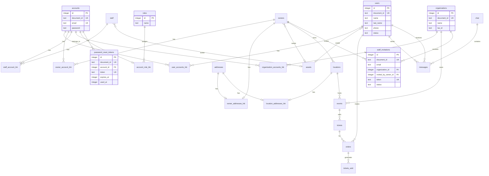

# DATABASE.md — Repo

Documentación del esquema y la capa de acceso a datos del monorepo **Repo**, alineada con `packages/db/src/schema/` y `packages/db/src/repositories/`.

---

## Resumen

| Aspecto      | Detalle                                                                 |
| ------------ | ----------------------------------------------------------------------- |
| Motor        | SQLite (libSQL)                                                         |
| Hosting      | [Turso](https://turso.tech/) en producción; archivo local en desarrollo |
| ORM          | [Drizzle ORM](https://orm.drizzle.team/)                                |
| Paquete      | `@repo/db`                                                              |
| Schemas      | `packages/db/src/schema/`                                               |
| Repositorios | `packages/db/src/repositories/`                                         |
| Migraciones  | `packages/db/src/migrations/`                                           |
| Tablas       | 31                                                                      |

La API (`apps/api`) importa **repositorios**, tipos y el cliente desde `@repo/db`. Las consultas Drizzle viven en `repositories/`; los servicios NestJS solo orquestan reglas de negocio y excepciones HTTP. No hay TypeORM ni entidades con decoradores.

---

## Catálogo de tablas

Cada tabla incluye las columnas base (`id`, `document_id`, `created_at`, `updated_at`) salvo que se indique lo contrario.

| Tabla SQL                   | Export TS                 | Archivo schema                | Tipo      |
| --------------------------- | ------------------------- | ----------------------------- | --------- |
| `users`                     | `users`                   | `user.ts`                     | Entidad   |
| `owners`                    | `owners`                  | `owner.ts`                    | Entidad   |
| `staff`                     | `staff`                   | `staff.ts`                    | Entidad   |
| `accounts`                  | `accounts`                | `account.ts`                  | Entidad   |
| `roles`                     | `roles`                   | `role.ts`                     | Entidad   |
| `addresses`                 | `addresses`               | `address.ts`                  | Entidad   |
| `assets`                    | `assets`                  | `asset.ts`                    | Entidad   |
| `organizations`             | `organizations`           | `organization.ts`             | Entidad   |
| `locations`                 | `locations`               | `location.ts`                 | Entidad   |
| `events`                    | `events`                  | `event.ts`                    | Entidad   |
| `event_faqs`                | `eventFaqs`               | `event-faq.ts`                | Entidad   |
| `services`                  | `services`                | `service.ts`                  | Entidad   |
| `tickets`                   | `tickets`                 | `ticket.ts`                   | Entidad   |
| `orders`                    | `orders`                  | `orders.ts`                   | Entidad   |
| `tickets_sold`              | `ticketsSold`             | `tickets_sold.ts`             | Entidad   |
| `chat`                      | `chats`                   | `chat.ts`                     | Entidad   |
| `messages`                  | `messages`                | `messages.ts`                 | Entidad   |
| `staff_invitations`         | `staffInvitations`        | `staff-invitation.ts`         | Entidad   |
| `password_reset_tokens`     | `passwordResetTokens`     | `password-reset-token.ts`     | Entidad   |
| `user_registration_tokens`  | `userRegistrationTokens`  | `user-registration-token.ts`  | Entidad   |
| `owner_registration_tokens` | `ownerRegistrationTokens` | `owner-registration-token.ts` | Entidad   |
| `api_error_records`         | `apiErrorRecords`         | `api-error-record.ts`         | Operativa |
| `account_role_lnk`          | `accountRolesLnk`         | `account-role-lnk.ts`         | Enlace    |
| `user_accounts_lnk`         | `userAccountsLnk`         | `user-account-lnk.ts`         | Enlace    |
| `owner_account_lnk`         | `ownerAccountsLnk`        | `owner-account-lnk.ts`        | Enlace    |
| `staff_account_lnk`         | `staffAccountsLnk`        | `staff-account-lnk.ts`        | Enlace    |
| `organization_accounts_lnk` | `organizationAccountsLnk` | `organization-account-lnk.ts` | Enlace    |
| `owner_addresses_lnk`       | `ownerAddressesLnk`       | `owner-address-lnk.ts`        | Enlace    |
| `location_addresses_lnk`    | `locationAddressesLnk`    | `location-address-lnk.ts`     | Enlace    |
| `location_assets_lnk`       | `locationAssetsLnk`       | `location-asset-lnk.ts`       | Enlace    |
| `event_assets_lnk`          | `eventAssetsLnk`          | `event-asset-lnk.ts`          | Enlace    |

Tipos inferidos por tabla: `{Nombre}Select` y `{Nombre}Insert` (ej. `UserSelect`, `StaffInvitationInsert`).

---

## Convenciones

### Columnas base

Definidas en `schema/base.ts` mediante `createBaseColumns(table)`:

| Columna (TS) | Columna (SQL) | Tipo                       | Descripción                                                        |
| ------------ | ------------- | -------------------------- | ------------------------------------------------------------------ |
| `id`         | `id`          | `integer` PK autoincrement | Clave interna; destino de todas las FKs                            |
| `documentId` | `document_id` | `text` UNIQUE              | UUID generado con `crypto.randomUUID()`; usar en API y JWT (`sub`) |
| `createdAt`  | `created_at`  | `integer` (timestamp)      | Fecha de creación                                                  |
| `updatedAt`  | `updated_at`  | `integer` (timestamp)      | Última actualización                                               |

**Regla:** las FKs apuntan a `*.id` (entero). Endpoints y frontend exponen `documentId` (string).

### Enums

Los valores de columnas `text` con enum provienen de `packages/types/src/domain.ts`:

| Constante                 | Valores                                         |
| ------------------------- | ----------------------------------------------- |
| `USER_STATUS`             | `active`, `inactive`, `private`                 |
| `OWNER_STATUS`            | `active`, `inactive`, `pending`                 |
| `STAFF_STATUS`            | `active`, `inactive`                            |
| `USER_ROLE`               | `user`, `admin`, `owner`, `staff`               |
| `STAFF_INVITATION_STATUS` | `pending`, `accepted`, `expired`, `cancelled`   |
| `TICKET_STATUS`           | `active`, `inactive`                            |
| `TICKET_TYPE`             | `general`, `vip`                                |
| `PAYMENT_STATUS`          | `completed`, `pending`, `rejected`, `cancelled` |
| `PAYMENT_PROVIDER`        | `mercado_pago`                                  |
| `ASSET_TYPE`              | `img`, `video`                                  |

Nota: `staff_invitations.role` solo admite `user`, `owner` y `staff` (no `admin`).

### Tablas de enlace (`*_lnk`)

| Tabla                       | Cardinalidad | Descripción           |
| --------------------------- | ------------ | --------------------- |
| `user_accounts_lnk`         | N:1 por lado | Usuario ↔ cuenta      |
| `owner_account_lnk`         | N:1 por lado | Owner ↔ cuenta        |
| `staff_account_lnk`         | N:1 por lado | Staff ↔ cuenta        |
| `organization_accounts_lnk` | N:M          | Organización ↔ cuenta |
| `account_role_lnk`          | 1:1          | Cuenta ↔ rol          |
| `owner_addresses_lnk`       | 1:1          | Owner ↔ domicilio     |
| `location_addresses_lnk`    | 1:1          | Location ↔ domicilio  |
| `location_assets_lnk`       | N:M          | Location ↔ asset      |
| `event_assets_lnk`          | N:M          | Evento ↔ asset        |

`staff_location_lnk` fue eliminada: la autorización de staff se resuelve mediante membresías de cuenta en `organization_accounts_lnk`.

---

## Diagrama de relaciones


```mermaid
erDiagram
  users ||--o{ user_accounts_lnk : has
  owners ||--o{ owner_account_lnk : has
  staff ||--o{ staff_account_lnk : has
  accounts ||--o{ user_accounts_lnk : has
  accounts ||--o{ owner_account_lnk : has
  accounts ||--o{ staff_account_lnk : has
  accounts ||--o{ organization_accounts_lnk : belongs_to
  organizations ||--o{ organization_accounts_lnk : has
  accounts ||--o| account_role_lnk : has
  roles ||--o{ account_role_lnk : assigns
  owners ||--o| owner_addresses_lnk : has
  addresses ||--o| owner_addresses_lnk : has
  users }o--o| assets : avatar
  owners }o--o| assets : avatar
  staff }o--o| assets : avatar

  owners ||--o{ locations : owns
  locations ||--o| location_addresses_lnk : has
  addresses ||--o| location_addresses_lnk : has
  organizations ||--o{ events : owns
  locations ||--o{ events : hosts
  events ||--o{ tickets : sells
  accounts ||--o{ password_reset_tokens : has
  organizations ||--o{ staff_invitations : receives
  owners ||--o{ staff_invitations : invites
  users ||--o{ orders : makes
  tickets ||--o{ orders : for
  orders ||--o{ tickets_sold : generates

  users ||--o{ messages : sends
  users ||--o{ messages : receives
  chat ||--o{ messages : contains

  users {
    integer id PK
    text document_id UK
    text name
    text last_name
    text phone
    text status
  }

  accounts {
    integer id PK
    text document_id UK
    text email UK
    text password
  }

  roles {
    integer id PK
    text name
  }

  organizations {
    integer id PK
    text document_id UK
    text name
    text tax_id
  }

  staff_invitations {
    integer id PK
    text document_id UK
    text email
    integer organization_id FK
    integer invited_by_owner_id FK
    text token UK
    text status
  }

  password_reset_tokens {
    integer id PK
    text document_id UK
    integer account_id FK
    text token UK
    integer expires_at
    integer used_at
  }
```

---

## Entidades

### Identidad y acceso

#### `users` — `user.ts`

Perfil de persona (sin credenciales).

| Columna (TS) | SQL           | Tipo    | Null | Default                  |
| ------------ | ------------- | ------- | ---- | ------------------------ |
| `name`       | `name`        | text    | NO   | —                        |
| `lastName`   | `last_name`   | text    | NO   | —                        |
| `phone`      | `phone`       | text    | NO   | —                        |
| `avatarId`   | `avatar_id`   | integer | SÍ   | FK → `assets.id`         |
| `birthday`   | `birthday`    | text    | SÍ   | —                        |
| `nationalId` | `national_id` | text    | SÍ   | —                        |
| `status`     | `status`      | text    | NO   | `active` (`USER_STATUS`) |

#### `owners` — `owner.ts`

Perfil de propietario (mismas columnas que `users`, sin credenciales).

| Columna (TS) | SQL           | Tipo    | Null | Default                   |
| ------------ | ------------- | ------- | ---- | ------------------------- |
| `name`       | `name`        | text    | NO   | —                         |
| `lastName`   | `last_name`   | text    | NO   | —                         |
| `phone`      | `phone`       | text    | NO   | —                         |
| `avatarId`   | `avatar_id`   | integer | SÍ   | FK → `assets.id`          |
| `birthday`   | `birthday`    | text    | SÍ   | —                         |
| `nationalId` | `national_id` | text    | SÍ   | —                         |
| `status`     | `status`      | text    | NO   | `active` (`OWNER_STATUS`) |

La identidad comercial ya no vive en `owners`; se persiste en `organizations`.

#### `organizations` — `organization.ts`

| Columna (TS) | SQL      | Tipo | Null | Notas                     |
| ------------ | -------- | ---- | ---- | ------------------------- |
| `name`       | `name`   | text | NO   | Nombre comercial          |
| `taxId`      | `tax_id` | text | SÍ   | Identificación tributaria |

#### `staff` — `staff.ts`

Perfil de staff (nombre, contacto y estado; sin credenciales).

| Columna (TS) | SQL         | Tipo    | Null | Default                   |
| ------------ | ----------- | ------- | ---- | ------------------------- |
| `name`       | `name`      | text    | NO   | —                         |
| `lastName`   | `last_name` | text    | NO   | —                         |
| `phone`      | `phone`     | text    | NO   | —                         |
| `avatarId`   | `avatar_id` | integer | SÍ   | FK → `assets.id`          |
| `status`     | `status`    | text    | NO   | `active` (`STAFF_STATUS`) |

#### `accounts` — `account.ts`

Credenciales de acceso.

| Columna (TS)        | SQL                   | Tipo | Null | Notas                                         |
| ------------------- | --------------------- | ---- | ---- | --------------------------------------------- |
| `email`             | `email`               | text | NO   | UNIQUE                                        |
| `password`          | `password`            | text | SÍ   | Hash bcrypt; null si `provider = google`      |
| `provider`          | `provider`            | text | NO   | `local` \| `google` (default `local`)         |
| `providerAccountId` | `provider_account_id` | text | SÍ   | UNIQUE; Google `sub` cuando `provider=google` |

#### `roles` — `role.ts`

Catálogo de roles.

| Columna (TS)  | SQL           | Tipo | Null |
| ------------- | ------------- | ---- | ---- |
| `name`        | `name`        | text | NO   |
| `description` | `description` | text | SÍ   |

**Seed:** `src/seed/roles.ts` inserta `owner`, `admin`, `staff` y `user` si no existen.

#### `user_accounts_lnk` — `user-account-lnk.ts`

| Columna (TS) | SQL          | FK →          |
| ------------ | ------------ | ------------- |
| `userId`     | `user_id`    | `users.id`    |
| `accountId`  | `account_id` | `accounts.id` |

#### `owner_account_lnk` — `owner-account-lnk.ts`

| Columna (TS) | SQL          | FK →          |
| ------------ | ------------ | ------------- |
| `ownerId`    | `owner_id`   | `owners.id`   |
| `accountId`  | `account_id` | `accounts.id` |

#### `staff_account_lnk` — `staff-account-lnk.ts`

| Columna (TS) | SQL          | FK →          |
| ------------ | ------------ | ------------- |
| `staffId`    | `staff_id`   | `staff.id`    |
| `accountId`  | `account_id` | `accounts.id` |

#### `account_role_lnk` — `account-role-lnk.ts`

| Columna (TS) | SQL          | FK →          | Notas                     |
| ------------ | ------------ | ------------- | ------------------------- |
| `accountId`  | `account_id` | `accounts.id` | UNIQUE (1 rol por cuenta) |
| `roleId`     | `role_id`    | `roles.id`    |                           |

El JWT incluye `role` desde `roles.name` vía esta tabla.

#### `organization_accounts_lnk` — `organization-account-lnk.ts`

| Columna (TS)     | SQL               | FK →               | Notas                              |
| ---------------- | ----------------- | ------------------ | ---------------------------------- |
| `organizationId` | `organization_id` | `organizations.id` | UNIQUE junto con `account_id`      |
| `accountId`      | `account_id`      | `accounts.id`      | UNIQUE junto con `organization_id` |

Modela membresías N:M. Los flujos owner actuales usan un resolver estricto que exige exactamente una organización.

---

### Organizaciones y ubicación

#### `locations` — `location.ts`

| Columna (TS)  | SQL           | Tipo    | Null | Default          |
| ------------- | ------------- | ------- | ---- | ---------------- |
| `name`        | `name`        | text    | NO   | —                |
| `capacity`    | `capacity`    | text    | NO   | —                |
| `description` | `description` | text    | SÍ   | —                |
| `ownerId`     | `owner_id`    | integer | NO   | FK → `owners.id` |

#### `addresses` — `address.ts`

| Columna (TS)   | SQL             | Tipo | Null | Notas                                       |
| -------------- | --------------- | ---- | ---- | ------------------------------------------- |
| `address`      | `address`       | text | NO   | —                                           |
| `streetNumber` | `street_number` | text | NO   | —                                           |
| `state`        | `state`         | text | NO   | Provincia / estado                          |
| `city`         | `city`          | text | NO   | —                                           |
| `latitude`     | `latitude`      | real | SÍ   | Añadido en `0020`; markers del mapa público |
| `longitude`    | `longitude`     | real | SÍ   | Añadido en `0020`; markers del mapa público |

Join de discovery pública (`findPublishedEventsPaginated`): `events` → `locations` → `location_addresses_lnk` → `addresses`. **No hace falta migración nueva** para coords; si `latitude`/`longitude` son null, el evento sigue listándose y puede omitir marker.

#### `location_addresses_lnk` — `location-address-lnk.ts`

| Columna (TS) | SQL           | FK →           | Notas                             |
| ------------ | ------------- | -------------- | --------------------------------- |
| `locationId` | `location_id` | `locations.id` | UNIQUE (1 domicilio por location) |
| `addressId`  | `address_id`  | `addresses.id` | UNIQUE                            |

#### `owner_addresses_lnk` — `owner-address-lnk.ts`

| Columna (TS) | SQL          | FK →           | Notas                          |
| ------------ | ------------ | -------------- | ------------------------------ |
| `ownerId`    | `owner_id`   | `owners.id`    | UNIQUE (1 domicilio por owner) |
| `addressId`  | `address_id` | `addresses.id` | UNIQUE                         |

---

### Invitaciones de personal

#### `staff_invitations` — `staff-invitation.ts`

| Columna (TS)       | SQL                   | Tipo      | Null | Default                 |
| ------------------ | --------------------- | --------- | ---- | ----------------------- |
| `email`            | `email`               | text      | NO   | —                       |
| `organizationId`   | `organization_id`     | integer   | NO   | FK → `organizations.id` |
| `invitedByOwnerId` | `invited_by_owner_id` | integer   | NO   | FK → `owners.id`        |
| `slug`             | `slug`                | text      | NO   | Segmento URL            |
| `token`            | `token`               | text      | NO   | UNIQUE                  |
| `securityWordHash` | `security_word_hash`  | text      | SÍ   | SHA-256 opcional        |
| `expiresAt`        | `expires_at`          | timestamp | NO   | —                       |
| `status`           | `status`              | text      | NO   | `pending`               |
| `role`             | `role`                | text      | NO   | `staff`                 |
| `acceptedAt`       | `accepted_at`         | timestamp | SÍ   | —                       |

La aceptación crea la membresía de la cuenta staff en la organización invitante; la invitación no selecciona ni persiste una ubicación.

**Endpoint:** `POST /api/invitations/staff`

#### `password_reset_tokens` — `password-reset-token.ts`

| Columna (TS) | SQL          | Tipo      | Null | Default            |
| ------------ | ------------ | --------- | ---- | ------------------ |
| `accountId`  | `account_id` | integer   | NO   | FK → `accounts.id` |
| `token`      | `token`      | text      | NO   | UNIQUE             |
| `expiresAt`  | `expires_at` | timestamp | NO   | —                  |
| `usedAt`     | `used_at`    | timestamp | SÍ   | —                  |

**Endpoints:** `POST /api/auth/forgot-password`, `POST /api/auth/reset-password`

#### `user_registration_tokens` — `user-registration-token.ts`

Registro manual pendiente de verificación de email (sin `account` aún).

| Columna (TS)   | SQL             | Tipo      | Null | Default |
| -------------- | --------------- | --------- | ---- | ------- |
| `token`        | `token`         | text      | NO   | UNIQUE  |
| `email`        | `email`         | text      | NO   | —       |
| `name`         | `name`          | text      | NO   | —       |
| `lastName`     | `last_name`     | text      | NO   | —       |
| `passwordHash` | `password_hash` | text      | NO   | —       |
| `expiresAt`    | `expires_at`    | timestamp | NO   | —       |
| `usedAt`       | `used_at`       | timestamp | SÍ   | —       |

**Endpoints:** `POST /api/auth/register/user/request`, `POST /api/auth/register/user/confirm` (`028`)

#### `owner_registration_tokens` — `owner-registration-token.ts`

Registro manual de dueño pendiente de verificación de email (sin `account` aún).

| Columna (TS)   | SQL             | Tipo      | Null | Default |
| -------------- | --------------- | --------- | ---- | ------- |
| `token`        | `token`         | text      | NO   | UNIQUE  |
| `email`        | `email`         | text      | NO   | —       |
| `name`         | `name`          | text      | NO   | —       |
| `lastName`     | `last_name`     | text      | NO   | —       |
| `passwordHash` | `password_hash` | text      | NO   | —       |
| `expiresAt`    | `expires_at`    | timestamp | NO   | —       |
| `usedAt`       | `used_at`       | timestamp | SÍ   | —       |

**Endpoints:** `POST /api/auth/register/owner/request`, `POST /api/auth/register/owner/confirm` (`028`)

---

### Eventos

#### `events` — `event.ts`

| Columna (TS)     | SQL               | Tipo      | Null | Default                  |
| ---------------- | ----------------- | --------- | ---- | ------------------------ |
| `locationId`     | `location_id`     | integer   | NO   | FK → `locations.id`      |
| `organizationId` | `organization_id` | integer   | NO   | FK → `organizations.id`  |
| `name`           | `name`            | text      | NO   | —                        |
| `description`    | `description`     | text      | NO   | —                        |
| `startsAt`       | `starts_at`       | timestamp | NO   | —                        |
| `endsAt`         | `ends_at`         | timestamp | NO   | —                        |
| `location`       | `location`        | text      | SÍ   | Etiqueta opcional        |
| `status`         | `status`          | text      | NO   | `draft` (`EVENT_STATUS`) |

`organization_id` define el ownership y la identidad pública del organizador. `location_id` define el venue; no se usa para inferir autorización.

---

### Tickets y pagos

#### `tickets` — `ticket.ts`

| Columna (TS)   | SQL              | Tipo      | Null | Default          |
| -------------- | ---------------- | --------- | ---- | ---------------- |
| `name`         | `name`           | text      | NO   | —                |
| `price`        | `price`          | real      | NO   | —                |
| `quantity`     | `quantity`       | integer   | NO   | —                |
| `status`       | `status`         | text      | NO   | `active`         |
| `description`  | `description`    | text      | NO   | —                |
| `saleStartsAt` | `sale_starts_at` | timestamp | SÍ   | —                |
| `saleEndsAt`   | `sale_ends_at`   | timestamp | SÍ   | —                |
| `eventId`      | `event_id`       | integer   | SÍ   | FK → `events.id` |
| `type`         | `type`           | text      | NO   | `general`        |

#### `orders` — `orders.ts`

| Columna (TS)      | SQL                 | Tipo      | Null   | FK / default                                         |
| ----------------- | ------------------- | --------- | ------ | ---------------------------------------------------- |
| `ticketId`        | `ticket_id`         | integer   | NO     | `tickets.id`                                         |
| `userId`          | `user_id`           | integer   | NO     | `users.id`                                           |
| `status`          | `status`            | text      | **SÍ** | Enum `PAYMENT_STATUS`; sin default en schema         |
| `amount`          | `amount`            | real      | NO     | —                                                    |
| `quantity`        | `quantity`          | integer   | NO     | Default `1`                                          |
| `provider`        | `provider`          | text      | NO     | Enum `PAYMENT_PROVIDER`; default `mercado_pago`      |
| `externalOrderId` | `external_order_id` | text      | SÍ     | UNIQUE; id de orden del proveedor (ej. Mercado Pago) |
| `metadata`        | `metadata`          | json      | SÍ     | Datos auxiliares del proveedor (sin el order id)     |
| `paidAt`          | `paid_at`           | timestamp | SÍ     | Fecha en que el pago pasó a `completed`              |

Columnas base: `createdAt` (creación de la orden / inicio de checkout), `updatedAt` (última modificación).

#### `tickets_sold` — `tickets_sold.ts`

| Columna (TS) | SQL          | Tipo         | Null | FK / notas                  |
| ------------ | ------------ | ------------ | ---- | --------------------------- |
| `orderId`    | `order_id`   | integer      | NO   | FK → `orders.id`            |
| `qrCode`     | `qr_code`    | text         | NO   | UNIQUE; código QR emitido   |
| `checkedIn`  | `checked_in` | boolean      | NO   | Default `false`             |
| `usedAt`     | `used_at`    | timestamp_ms | SÍ   | Fecha/hora de uso en puerta |

---

### Assets y servicios

#### `assets` — `asset.ts`

| Columna (TS) | SQL           | Tipo | Null |
| ------------ | ------------- | ---- | ---- |
| `name`       | `name`        | text | NO   |
| `url`        | `url`         | text | SÍ   |
| `storageKey` | `storage_key` | text | SÍ   |
| `type`       | `type`        | text | SÍ   |

#### `location_assets_lnk` — `location-asset-lnk.ts`

| Columna (TS) | SQL           | FK →           |
| ------------ | ------------- | -------------- |
| `locationId` | `location_id` | `locations.id` |
| `assetId`    | `asset_id`    | `assets.id`    |

#### `event_assets_lnk` — `event-asset-lnk.ts`

| Columna (TS) | SQL        | FK →        |
| ------------ | ---------- | ----------- |
| `eventId`    | `event_id` | `events.id` |
| `assetId`    | `asset_id` | `assets.id` |

#### `services` — `service.ts`

| Columna (TS)  | SQL           | Tipo | Null |
| ------------- | ------------- | ---- | ---- |
| `name`        | `name`        | text | NO   |
| `description` | `description` | text | SÍ   |

Sin FKs. Tabla independiente por ahora.

---

### Mensajería

#### `chat` — `chat.ts`

Export Drizzle: `chats`. Solo columnas base; sin campos adicionales.

#### `messages` — `messages.ts`

| Columna (TS) | SQL       | FK →         |
| ------------ | --------- | ------------ |
| `fromId`     | `from_id` | `users.id`   |
| `toId`       | `to_id`   | `users.id`   |
| `content`    | `content` | text (no FK) |
| `chatId`     | `chat_id` | `chat.id`    |

---

## Registros operativos

### `api_error_records` — `api-error-record.ts`

Diagnósticos saneados de fallos HTTP 5xx. No almacena cuerpos, headers, cookies, tokens ni metadatos de usuario. La API limita y redacta los campos de texto antes de insertar; no expone estos registros mediante endpoints.

| Columna (TS)    | SQL              | Tipo    | Null | Límite / notas                               |
| --------------- | ---------------- | ------- | ---- | -------------------------------------------- |
| `method`        | `method`         | text    | NO   | 16 caracteres                                |
| `path`          | `path`           | text    | NO   | 2048; sin query string                       |
| `statusCode`    | `status_code`    | integer | NO   | Solo respuestas 5xx                          |
| `errorName`     | `error_name`     | text    | NO   | 128 caracteres                               |
| `message`       | `message`        | text    | NO   | 4096; saneado                                |
| `stack`         | `stack`          | text    | SÍ   | 16384; saneado                               |
| `correlationId` | `correlation_id` | text    | SÍ   | 128; identificador de correlación disponible |
| `fingerprint`   | `fingerprint`    | text    | NO   | SHA-256 de 64 caracteres; default `legacy`   |

Índices: único base sobre `document_id`, `api_error_records_created_at_idx` sobre `created_at` y `api_error_records_fingerprint_created_at_idx` sobre `fingerprint, created_at`. La API suprime errores equivalentes durante cinco minutos mediante la huella calculada desde método, path, status, nombre, mensaje y stack saneados; `correlation_id` no participa. Un scheduler diario elimina los registros estrictamente anteriores a 30 días.

---

## Índices únicos

| Tabla                       | Columna(s)                                   |
| --------------------------- | -------------------------------------------- |
| Todas                       | `document_id` (`{tabla}_document_id_unique`) |
| `accounts`                  | `email`                                      |
| `staff_invitations`         | `token`                                      |
| `password_reset_tokens`     | `token`                                      |
| `user_registration_tokens`  | `token`                                      |
| `owner_registration_tokens` | `token`                                      |
| `owner_addresses_lnk`       | `owner_id`, `address_id`                     |
| `organization_accounts_lnk` | `organization_id`, `account_id`              |
| `orders`                    | `external_order_id`                          |
| `location_addresses_lnk`    | `location_id`, `address_id`                  |
| `tickets_sold`              | `qr_code`                                    |

---

## Migraciones

Las migraciones **nuevas** se generan con prefijo `timestamp` (`YYYYMMDDHHmmss_….sql`) vía `migrations.prefix` en las configuraciones de Drizzle, para evitar colisiones de índice secuencial entre ramas. Las históricas `0000`…`0020` se mantienen con prefijo numérico y no se renombran.

Historial en `src/migrations/meta/_journal.json`:

| #    | Archivo                                               | Cambio principal                                                                                                                |
| ---- | ----------------------------------------------------- | ------------------------------------------------------------------------------------------------------------------------------- |
| 0000 | `0000_ambitious_nocturne.sql`                         | Esquema inicial (17 tablas base)                                                                                                |
| 0001 | `0001_user_identity_fields.sql`                       | `users`: +`birthday`, +`national_id`, +`tax_id`; −`age`                                                                         |
| 0002 | `0002_addresses_entity.sql`                           | `addresses` + `*_addresses_lnk`; domicilio sale de `clubs`                                                                      |
| 0003 | `0003_fine_prism.sql`                                 | Tabla `staff_invitations`                                                                                                       |
| 0004 | `0004_cloudy_betty_ross.sql`                          | `staff_invitations.invited_by_user_id`                                                                                          |
| 0005 | `0005_complex_gorilla_man.sql`                        | `clubs.owner_user_id`                                                                                                           |
| 0006 | `0006_blushing_kronos.sql`                            | `account_role_lnk`; rol sale de `user_accounts_lnk`                                                                             |
| 0007 | `0007_shallow_famine.sql`                             | `owners` + `owner_account_lnk`                                                                                                  |
| 0008 | `0008_aspiring_brood.sql`                             | `users`: −`tax_id`                                                                                                              |
| 0009 | `0009_acoustic_maverick.sql`                          | `staff` + `staff_account_lnk`                                                                                                   |
| 0015 | `0015_friendly_kabuki.sql`                            | `payments` → `orders`; +`quantity`, `provider`, `metadata`; −`club_id`                                                          |
| 0016 | `0016_bent_stranger.sql`                              | Tabla `tickets_sold` (`order_id`, `qr_code`)                                                                                    |
| 0017 | `0017_grey_pixie.sql`                                 | Tabla `password_reset_tokens`                                                                                                   |
| 0020 | `0020_equal_shaman.sql`                               | `addresses`: +`latitude`, +`longitude`                                                                                          |
| —    | `20260803212105_typical_alice.sql`                    | `orders.external_order_id` (UNIQUE)                                                                                             |
| —    | `20260812165400_redundant_leader.sql`                 | Tabla `api_error_records` e índice de retención                                                                                 |
| —    | `20260812214325_clean_warbound.sql`                   | `api_error_records.fingerprint` e índice de deduplicación                                                                       |
| —    | `20260814212201_organization-account-memberships.sql` | Organizaciones, membresías N:M, ownership de eventos e invitaciones; elimina `staff_location_lnk` y campos comerciales de owner |

### Comandos (desde `packages/db`)

```bash
pnpm db:generate   # Generar migración tras cambiar schema/
pnpm db:migrate    # Aplicar migraciones pendientes
pnpm db:push       # Solo dev: sincronizar schema sin migración
pnpm db:reset      # Reset local + migrar + seed de roles
pnpm db:seed       # Seed de roles, fixtures y cuenta admin configurada
pnpm db:studio     # UI de Drizzle
```

### Variables de entorno

Definidas en `packages/validators/src/database.ts`:

| Variable              | Uso                                                     |
| --------------------- | ------------------------------------------------------- |
| `TURSO_DATABASE_URL`  | URL libSQL (`libsql://…` o `file:../../local.db`)       |
| `TURSO_AUTH_TOKEN`    | Token de Turso (vacío en local)                         |
| `NODE_ENV`            | `development` \| `production` \| `test`                 |
| `SEED_ADMIN_EMAIL`    | Email obligatorio de la cuenta platform-admin seed      |
| `SEED_ADMIN_PASSWORD` | Contraseña obligatoria de la cuenta platform-admin seed |
| `SEED_OWNER_*`        | Identidad y credenciales obligatorias del fixture owner |
| `SEED_BUYER_*`        | Identidad y credenciales obligatorias del fixture buyer |

`packages/db/.env` contiene los fixtures locales no-admin. `db:seed` no tiene una
contraseña admin por defecto: configure `SEED_ADMIN_EMAIL` y `SEED_ADMIN_PASSWORD`
en ese archivo antes de ejecutarlo. Volver a correrlo rota la contraseña y restablece
el rol `admin` de esa cuenta.

---

## Repositorios

Capa de acceso a datos en `src/repositories/`. Cada archivo agrupa las operaciones Drizzle de un dominio:

| Directorio           | Responsabilidad                                                      |
| -------------------- | -------------------------------------------------------------------- |
| `accounts/`          | Cuentas (`accounts`), búsqueda por email, join con roles             |
| `auth/`              | Registro de cuenta + perfil, login lookup compuesto                  |
| `locations/`         | CRUD de ubicaciones con dirección                                    |
| `events/`            | CRUD, ownership de organización y consultas públicas                 |
| `organizations/`     | Membresía y settings de organización                                 |
| `owners/`            | Perfiles owner                                                       |
| `orders/`            | Create/update orders, lookup por provider id, tickets_sold, stock    |
| `staff/`             | Personal y autorización por organización                             |
| `staff-invitations/` | Invitaciones por organización y aceptación transaccional             |
| `api-error-records/` | Inserción deduplicada de diagnósticos saneados y limpieza por cutoff |

**Convenciones:**

- Funciones exportadas con nombre (`findLocationByDocumentId`, `findSoleOrganizationByOwnerDocumentId`, …).
- Sin dependencias de NestJS ni excepciones HTTP — devolver `null` o lanzar `Error` genérico en fallos de persistencia inesperados.
- El servicio en `apps/api` traduce `null` → `NotFoundException`, etc.
- Tipos de entrada/salida del repositorio pueden definirse en el mismo archivo (`LocationUpsertInput`, `OwnerProfileRow`, …).
- Nuevas funciones: exportar en `repositories/index.ts` (re-exportadas por `src/index.ts`).

`api-error-records/` exporta `createApiErrorRecord`, `createApiErrorRecordUnlessRecent` y `deleteApiErrorRecordsBefore`. La API calcula la huella desde el input saneado y usa `createApiErrorRecordUnlessRecent` para insertar sólo cuando no existe una huella equivalente desde el cutoff de cinco minutos.

**Cliente:** `src/client.ts` exporta `db` y `Transaction`. Los repositorios importan desde ahí para evitar dependencias circulares con `index.ts`.

---

## Uso en código

### API (`apps/api`) — preferir repositorios

```ts
import { findLocationByDocumentId, createLocationWithAddress } from '@repo/db'

const location = await findLocationByDocumentId(documentId)
if (!location) throw new NotFoundException(LOCATION_MESSAGE.NOT_FOUND)

const row = await createLocationWithAddress(ownerId, input)
```

### Acceso directo a `db` (seeds, scripts, casos excepcionales)

```ts
import { db, users, locations } from '@repo/db'
import { eq, and } from 'drizzle-orm'

// Buscar por documentId (API / JWT)
const [user] = await db.select().from(users).where(eq(users.documentId, documentId)).limit(1)

// FK interna por id entero
const [location] = await db
  .select()
  .from(locations)
  .where(and(eq(locations.documentId, locationDocumentId), eq(locations.ownerId, owner.id)))
  .limit(1)
```

Transacciones: tipo `Transaction` exportado desde `@repo/db`. Los repositorios que componen varias escrituras encapsulan `db.transaction()` internamente o aceptan `tx: Transaction` como parámetro.

---

## Referencias

- [ARCHITECTURE.md](../../ARCHITECTURE.md) — capa de datos, repositorios y paquetes
- [DOMAIN.md](../../DOMAIN.md) — reglas de negocio y lenguaje de UI
- [AGENTS.md](../../AGENTS.md) — comandos y gotchas de Drizzle
- Schemas fuente: `src/schema/`
- Repositorios: `src/repositories/`
- Enums de dominio: `packages/types/src/domain.ts`
